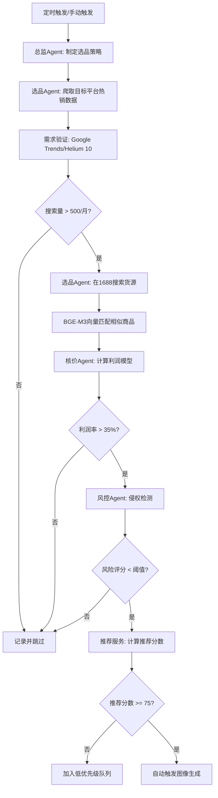
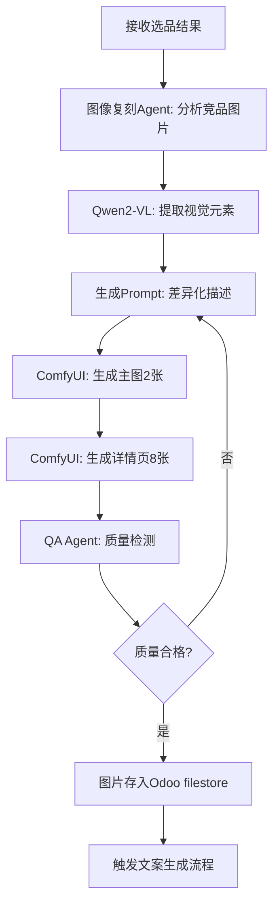
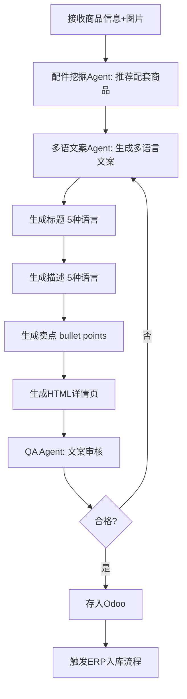
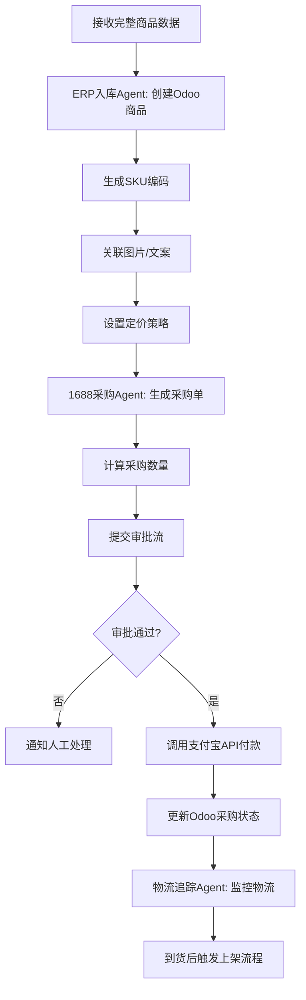
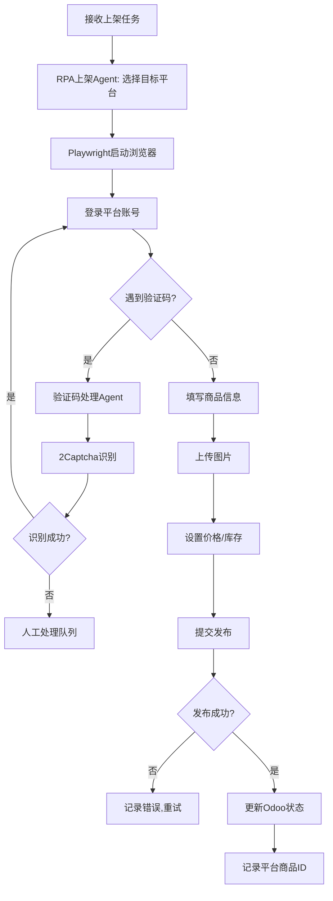
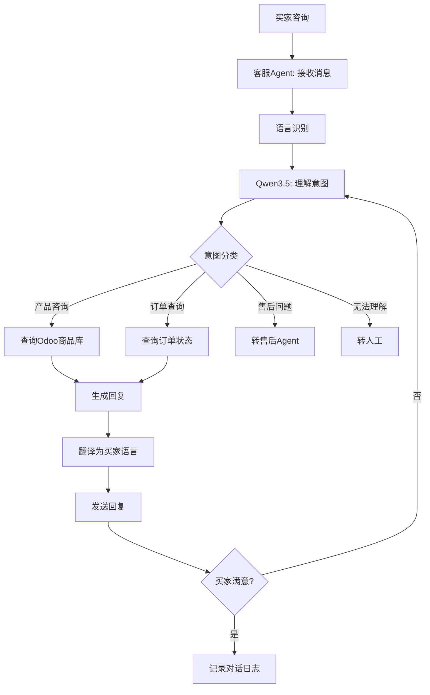
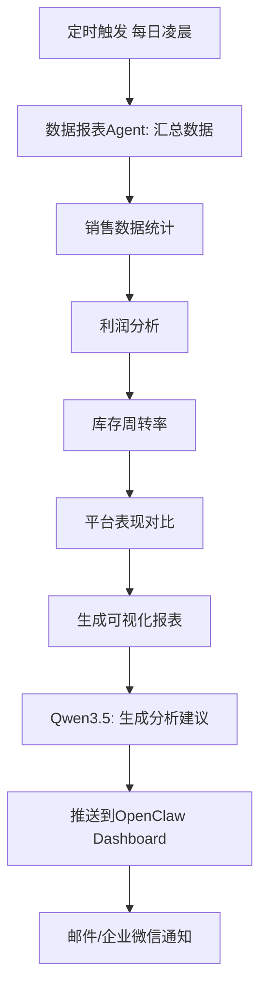
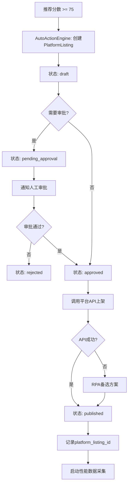
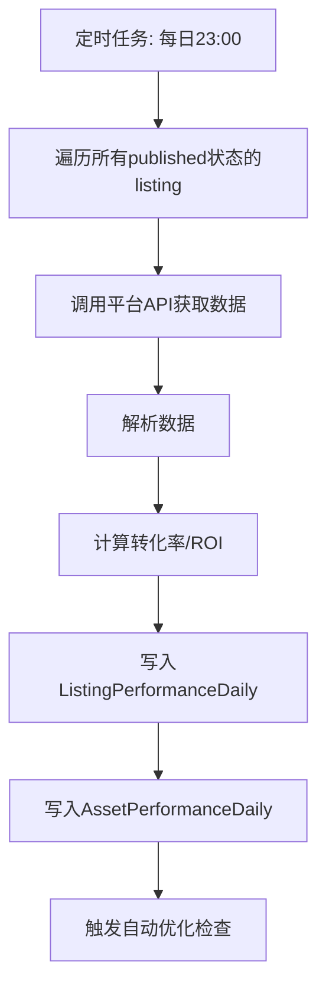
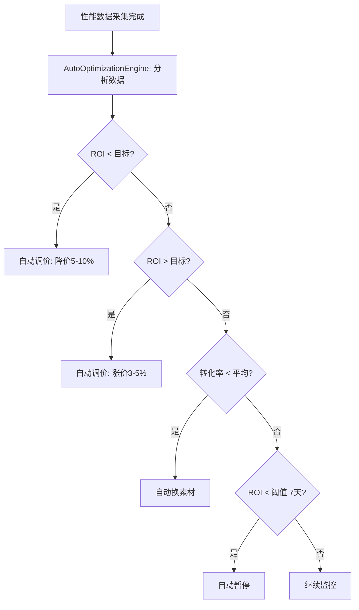

# 核心业务流程详细设计

> 最后更新: 2026-03-27
> 版本: v2.0（战略转向：自动化经营流程）

---

## 流程设计原则

### 当前主流程

```
发现 → 决策 → 自动执行 → 性能反馈 → 自动优化 → 人工审批兜底
```

**核心原则**：
1. **PlatformListing 是核心经营实体**（不是 CandidateProduct）
2. **自动执行优先**（能自动做的绝不让人手动）
3. **性能数据驱动**（基于真实转化率/ROI自动优化）
4. **人工审批兜底**（高风险操作需要审批，低风险自动执行）

---

## 流程一：自动化选品到上架全流程

### 1. 选品流程 (Product Selection Flow)



#### 详细步骤

**步骤1: 总监制定策略**
- 输入: 历史销售数据、季节性因素、库存情况
- 输出: 选品参数(品类、价格区间、目标平台)
- 工具: Qwen3.5分析历史数据

**步骤2: 爬取热销数据**
- 目标平台: Temu/速卖通/亚马逊
- 数据字段:
  - 商品标题、价格、销量、评分
  - 主图URL、详情页URL
  - 卖家信息、上架时间
- 存储: PostgreSQL + 原始HTML存Odoo filestore
- 并发: n8n队列，50个并行爬虫

**步骤3: 需求验证（新增）**
- Google Trends 搜索量验证（>500/月）
- Helium 10 API 增强（可选）
- 竞争密度评估（<5000 搜索结果）
- 趋势方向分类（rising/stable/declining）
- Redis 缓存（24h TTL）

**步骤4: 1688货源匹配**
- 方法1: 关键词搜索(提取核心词)
- 方法2: 图像搜索(Qwen2-VL提取特征 → 1688图搜)
- 方法3: 向量相似度(BGE-M3匹配商品描述)
- 输出: Top 10候选供应商

**步骤5: 利润计算**
```python
利润率 = (目标平台售价 - 1688采购价 - 物流成本 - 平台佣金) / 目标平台售价

考虑因素:
- 汇率波动 (±3%)
- 物流成本 (按重量/体积计算)
- 平台佣金 (5-15%不等)
- 支付手续费 (1-2%)
- 退货率 (5-10%)

阈值:
- 基础阈值: 35%
- 平台特定: Amazon 40%, Temu 30%, AliExpress 35%
- 品类特定: Electronics 25%, Jewelry 50%, Home 35%
```

**步骤6: 风控检测**
- 侵权检测:
  - 品牌词识别 (Nike, Adidas等)
  - 图像相似度对比(已知侵权库)
  - 专利检索(可选)
- 合规检测:
  - 禁售品类(武器、药品等)
  - 目标国家法规(如欧盟CE认证)
- 竞争密度风险:
  - 高竞争 = 80分
  - 中竞争 = 50分
  - 低竞争 = 20分
- 组合风险评分: 合规风险 * 0.6 + 竞争风险 * 0.4

**步骤7: 推荐评分（内部服务）**
```python
recommendation_score = (
    priority_score * 40 +           # 优先级 40% (季节性、销量、评分、竞争)
    margin_score * 30 +             # 利润率 30%
    risk_score_inverse * 20 +       # 风险反向 20%
    supplier_quality * 10 +         # 供应商质量 10%
    demand_adjustment               # 需求上下文调整
)

推荐等级:
- HIGH (≥75): 自动触发图像生成
- MEDIUM (60-74): 加入低优先级队列
- LOW (<60): 记录并跳过
```

**关键变化**：
- ❌ 不再展示推荐页面让人手动选择
- ✅ 推荐分数 ≥75 自动触发下一步
- ✅ 推荐服务降级为内部决策引擎

---

### 2. 图像生成流程 (Image Generation Flow)



#### 详细步骤

**步骤1: 竞品图片分析**
- 输入: 竞品主图 + 详情页图片
- Qwen2-VL提取:
  - 产品角度、光线、背景
  - 文字标注内容
  - 色彩风格
  - 场景布局
- 输出: 结构化描述JSON

**步骤2: 差异化Prompt生成**
```python
原竞品: "白色背景，产品45度角，蓝色调"
差异化: "浅灰渐变背景，产品正面+侧面组合，暖色调"

策略:
- 保留产品核心特征
- 改变背景、角度、色调
- 添加场景化元素(使用场景、配件)
```

**步骤3: ComfyUI工作流**
```
主图生成 (2张):
  - 图1: 纯白背景，产品特写
  - 图2: 场景化，展示使用效果

详情页生成 (8张):
  - 图1-2: 产品细节(材质、工艺)
  - 图3-4: 尺寸对比、规格说明
  - 图5-6: 使用场景
  - 图7-8: 包装、配件

技术参数:
  - 模型: FLUX.1-dev (FP8) + Turbo LoRA + IPAdapter Plus + ControlNet
  - 分辨率: 1024x1024 (主图), 800x1200 (详情页)
  - 生成时间: 8-12秒/张 (主图), 10-15秒/张 (详情页)
  - IPAdapter: 风格迁移，保持爆款风格一致性
  - ControlNet: 结构控制，防止产品变形
```

**步骤4: 质量检测**
- 自动检测:
  - 分辨率达标
  - 无明显瑕疵(模糊、变形)
  - 产品主体清晰
  - 无敏感内容
- AI评分: Qwen2-VL打分 (0-100)
- 阈值: >85分通过，否则重新生成(最多3次)

---

### 3. 文案生成流程 (Content Generation Flow)



#### 详细步骤

**步骤1: 配件挖掘**
```python
输入: 主商品信息
输出: 3-5个配套商品

策略:
- 功能互补 (手机壳 → 钢化膜)
- 场景关联 (帐篷 → 睡袋)
- 消耗品 (打印机 → 墨盒)

数据来源:
- 1688"买了又买"数据
- 目标平台"Frequently Bought Together"
- AI推理(Qwen3.5)
```

**步骤2: 多语言文案生成**
```
目标语言: 英语、西班牙语、日语、俄语、葡萄牙语

标题生成 (每语言):
  - 长度: 60-80字符
  - 包含: 核心关键词 + 卖点
  - 符合平台SEO规则

描述生成:
  - 段落1: 产品概述
  - 段落2-3: 核心卖点
  - 段落4: 使用场景
  - 段落5: 规格参数
  - 段落6: 售后保障

Bullet Points (5-7条):
  - 每条15-25词
  - 突出差异化优势
```

**步骤3: HTML详情页生成**
```html
模板结构:
- 头部: 主图轮播
- 卖点区: 图文结合
- 参数区: 表格展示
- 场景区: 大图展示
- FAQ区: 常见问题
- 保障区: 退换货政策

响应式设计: 适配PC/移动端
```

---

### 4. ERP入库与采购流程



#### 详细步骤

**步骤1: Odoo商品创建**
```python
商品字段:
- SKU: 自动生成 (品类码+日期+序号)
- 名称: 多语言
- 图片: 关联filestore路径
- 成本价: 1688采购价
- 售价: 各平台定价
- 库存: 初始为0
- 供应商: 1688店铺信息
```

**步骤2: 定价策略**
```python
基础定价:
售价 = (采购价 + 物流) × (1 + 目标利润率) / (1 - 平台佣金率)

动态调整:
- 竞品价格监控 (每日更新)
- 汇率波动 (实时API)
- 促销活动 (节假日降价)
```

**步骤3: 采购数量计算**
```python
首次采购量 = 预测日销量 × 安全库存天数

预测日销量:
- 新品: 参考同类商品历史数据
- 老品: 基于历史销量 + 趋势预测

安全库存天数:
- 快消品: 7-10天
- 标品: 15-20天
- 慢销品: 30天
```

**步骤4: 审批流**
```
触发条件:
- 单笔采购 > 5000元
- 新供应商首次合作
- 风险评分 > 50

审批方式:
- 企业微信/钉钉通知
- OpenClaw Dashboard审批按钮
- 超时自动拒绝(24小时)
```

**步骤5: 支付宝付款**
```python
API: alipay.fund.trans.uni.transfer

参数:
- out_biz_no: 订单号
- trans_amount: 金额
- product_code: TRANS_ACCOUNT_NO_PWD
- payee_info: 收款方支付宝账号

安全措施:
- 双重验证(审批+密码)
- 单日限额
- 异常交易告警
```

---

### 5. RPA上架流程



#### 详细步骤

**步骤1: 平台适配**
```python
支持平台:
- 速卖通: API + RPA混合
- Temu: 纯RPA (API未开放)
- 亚马逊: SP-API
- Ozon: API
- 乐天: RPA
- 美客多: API

RPA策略:
- 无头浏览器 (headless=True)
- 随机User-Agent
- 模拟人类操作 (随机延迟)
- Cookie持久化 (避免频繁登录)
```

**步骤2: 验证码处理**
```python
三层防护:

1. 预防层:
   - 使用已验证的Cookie
   - 控制操作频率
   - 模拟真实用户行为

2. 自动识别层:
   - 图片验证码: 2Captcha API
   - 滑块验证码: 轨迹模拟算法
   - 点选验证码: Qwen2-VL识别

3. 人工处理层:
   - 推送到OpenClaw Dashboard
   - 人工在5分钟内处理
   - 超时则任务失败
```

**步骤3: 商品信息填写**
```python
字段映射:
Odoo字段 → 平台字段

标题: 根据平台限制截断
描述: HTML转平台格式
图片: 先上传到平台CDN
价格: 转换为目标货币
库存: 设置为采购量
类目: AI自动匹配平台类目树
```

**步骤4: 失败重试机制**
```python
重试策略:
- 网络错误: 立即重试 (最多3次)
- 验证码失败: 5分钟后重试
- 平台限流: 1小时后重试
- 其他错误: 记录日志,人工介入

失败通知:
- 企业微信/钉钉
- OpenClaw Dashboard红色告警
```

---

## 流程二：客服与售后流程

### 6. 智能客服流程



---

## 流程三：数据分析与优化流程

### 7. 数据报表流程



---

## 流程二：自动化经营流程（2026-03-27 新增）

### 核心理念

**从"推荐分析"到"自动执行"**

旧流程：候选 → 推荐分数 → 人工决策 → 手动反馈
新流程：候选 → 自动上架 → 性能数据 → 自动优化 → 人工审批兜底

### 1. 自动上架流程 (Auto-Publish Flow)



#### 审批边界配置

```python
# backend/app/core/config.py

AUTO_PUBLISH_RULES = {
    "require_approval": {
        "first_time_product": True,      # 首次上架需要审批
        "high_risk_category": True,      # 高风险品类需要审批
        "price_above": 100,              # 售价 > $100 需要审批
        "margin_below": 0.25,            # 利润率 < 25% 需要审批
    },
    "auto_execute": {
        "recommendation_score_above": 75,  # 推荐分数 >= 75 自动执行
        "risk_score_below": 30,            # 风险分数 < 30 自动执行
        "margin_above": 0.35,              # 利润率 >= 35% 自动执行
    }
}
```

#### API-first, RPA-second

```python
# backend/app/services/auto_action_engine.py

async def publish_to_platform(listing: PlatformListing):
    """自动上架到平台"""

    # 1. 优先使用平台API
    if listing.platform == "temu":
        try:
            result = await temu_api.create_product(listing)
            return result
        except APIError as e:
            logger.warning(f"Temu API failed: {e}, fallback to RPA")
            # 2. API失败时使用RPA
            return await rpa_publisher.publish_temu(listing)

    elif listing.platform == "amazon":
        return await amazon_sp_api.create_product(listing)

    elif listing.platform == "aliexpress":
        return await aliexpress_api.create_product(listing)
```

### 2. 性能数据采集流程 (Performance Data Collection)



#### 数据采集任务

```python
# backend/app/workers/tasks_performance.py

@celery_app.task
async def collect_listing_performance():
    """采集商品性能数据"""

    listings = await db.query(PlatformListing).filter(
        PlatformListing.status == "published"
    ).all()

    for listing in listings:
        # 调用平台API获取数据
        data = await platform_api.get_product_stats(
            platform=listing.platform,
            product_id=listing.platform_listing_id,
            date=today
        )

        # 计算指标
        conversion_rate = data["orders"] / data["clicks"] if data["clicks"] > 0 else 0
        roi = (data["gmv"] - listing.cost) / listing.cost if listing.cost > 0 else 0

        # 写入数据库
        await db.add(ListingPerformanceDaily(
            listing_id=listing.id,
            date=today,
            impressions=data["impressions"],
            clicks=data["clicks"],
            orders=data["orders"],
            gmv=data["gmv"],
            conversion_rate=conversion_rate,
            roi=roi
        ))
```

### 3. 自动优化流程 (Auto-Optimization Flow)



#### 自动调价逻辑

```python
# backend/app/services/auto_optimization_engine.py

async def auto_reprice(listing: PlatformListing):
    """基于ROI自动调价"""

    # 获取最近7天性能数据
    perf_data = await db.query(ListingPerformanceDaily).filter(
        ListingPerformanceDaily.listing_id == listing.id,
        ListingPerformanceDaily.date >= today - timedelta(days=7)
    ).all()

    avg_roi = sum(p.roi for p in perf_data) / len(perf_data)
    target_roi = 0.3  # 目标ROI 30%

    if avg_roi < target_roi * 0.8:  # ROI < 24%
        # 降价 5-10%
        new_price = listing.price * 0.92
        await update_price(listing, new_price, reason="low_roi")

    elif avg_roi > target_roi * 1.2:  # ROI > 36%
        # 涨价 3-5%
        new_price = listing.price * 1.04
        await update_price(listing, new_price, reason="high_roi")
```

#### 自动换素材逻辑

```python
async def auto_switch_asset(listing: PlatformListing):
    """基于转化率自动切换素材"""

    # 获取当前素材性能
    current_asset_perf = await db.query(AssetPerformanceDaily).filter(
        AssetPerformanceDaily.asset_id == listing.main_image_id,
        AssetPerformanceDaily.date >= today - timedelta(days=7)
    ).all()

    avg_ctr = sum(p.click_rate for p in current_asset_perf) / len(current_asset_perf)

    # 获取平均点击率
    platform_avg_ctr = await get_platform_avg_ctr(listing.platform, listing.category)

    if avg_ctr < platform_avg_ctr * 0.8:  # 点击率低于平均80%
        # 切换到备选素材
        alternative_assets = await db.query(ContentAsset).filter(
            ContentAsset.candidate_id == listing.candidate_id,
            ContentAsset.asset_type == "main_image",
            ContentAsset.id != listing.main_image_id
        ).all()

        if alternative_assets:
            best_asset = max(alternative_assets, key=lambda a: a.quality_score)
            await update_listing_asset(listing, best_asset, reason="low_ctr")
```

#### 自动暂停逻辑

```python
async def auto_pause(listing: PlatformListing):
    """基于ROI自动暂停低效商品"""

    # 获取最近7天性能数据
    perf_data = await db.query(ListingPerformanceDaily).filter(
        ListingPerformanceDaily.listing_id == listing.id,
        ListingPerformanceDaily.date >= today - timedelta(days=7)
    ).all()

    if len(perf_data) < 7:
        return  # 数据不足，不暂停

    avg_roi = sum(p.roi for p in perf_data) / len(perf_data)
    roi_threshold = 0.1  # ROI阈值 10%

    if avg_roi < roi_threshold:
        # 自动暂停
        await pause_listing(listing, reason="low_roi_7days")

        # 记录RunEvent
        await db.add(RunEvent(
            event_type="auto_pause",
            entity_type="platform_listing",
            entity_id=listing.id,
            metadata={
                "avg_roi": avg_roi,
                "threshold": roi_threshold,
                "reason": "low_roi_7days"
            }
        ))
```

### 4. 人工审批工作台 (Approval Workbench)

**前端UI变更**：

旧UI：`RecommendationsPage.vue`（推荐列表 + 详情抽屉 + 分析看板）
新UI：`ApprovalWorkbench.vue`（待审批列表 + 审批详情 + 快速审批按钮）

```vue
<!-- frontend/src/pages/approval/ApprovalWorkbench.vue -->

<template>
  <div class="approval-workbench">
    <n-tabs>
      <n-tab-pane name="pending" tab="待审批">
        <n-data-table
          :columns="columns"
          :data="pendingListings"
          :pagination="pagination"
        />
      </n-tab-pane>

      <n-tab-pane name="history" tab="审批历史">
        <!-- 审批历史记录 -->
      </n-tab-pane>
    </n-tabs>

    <!-- 审批详情抽屉 -->
    <n-drawer v-model:show="showDetail">
      <n-drawer-content title="审批详情">
        <!-- 商品信息、推荐分数、风险评估 -->

        <template #footer>
          <n-space>
            <n-button type="success" @click="approve">
              批准上架
            </n-button>
            <n-button type="error" @click="reject">
              拒绝
            </n-button>
            <n-button @click="defer">
              延后决策
            </n-button>
          </n-space>
        </template>
      </n-drawer-content>
    </n-drawer>
  </div>
</template>
```

### 5. 性能监控面板 (Performance Monitoring)

**降级后的数据看板**（不再是主产品）：

```vue
<!-- frontend/src/pages/monitoring/PerformanceMonitoring.vue -->

<template>
  <div class="performance-monitoring">
    <n-grid cols="4" x-gap="12">
      <!-- KPI卡片 -->
      <n-gi>
        <n-statistic label="今日GMV" :value="todayGMV" />
      </n-gi>
      <n-gi>
        <n-statistic label="平均ROI" :value="avgROI" suffix="%" />
      </n-gi>
      <n-gi>
        <n-statistic label="自动执行次数" :value="autoActionCount" />
      </n-gi>
      <n-gi>
        <n-statistic label="待审批数量" :value="pendingApprovalCount" />
      </n-gi>
    </n-grid>

    <!-- 异常告警 -->
    <n-alert v-if="hasAlerts" type="warning" title="异常告警">
      <ul>
        <li v-for="alert in alerts" :key="alert.id">
          {{ alert.message }}
        </li>
      </ul>
    </n-alert>

    <!-- 性能趋势图表 -->
    <div ref="chartRef" style="height: 400px"></div>
  </div>
</template>
```

---

---

**文档维护**: 本文档应在业务流程变更后同步更新

